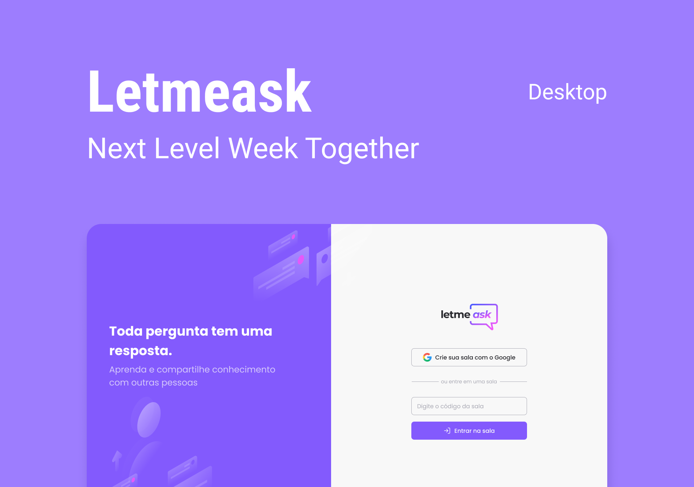

  

  
  
  
  

 <a href="#eye_speech_bubble-preview">Preview</a> •
 <a href="#information_source-about">About</a> •
 <a href="#arrow_forward-run">Run</a> •
 <a href="#hammer_and_wrench-technologies">Technologies</a> •
 <a href="#boy-author">Author</a> •
 <a href="#balance_scale-license">License</a>

---

## :eye_speech_bubble: **Preview**

### :desktop_computer: Desktop

## |Admin View|

  

    <kbd></kbd>
    <kbd></kbd>
  

    

    <kbd></kbd>
    <kbd></kbd>
  

   

    <kbd></kbd>
    <kbd></kbd>
  

## |User View|

  

    <kbd></kbd>
    <kbd></kbd>
  

---

## :information_source: About

#### App developed during Rocketseat's NLW together!

---

## :arrow_forward: **Run**

To run the project you need to clone or [`download`](https://github.com/lucasyule2212/NLW-LetMeAsk/archive/main.zip) this repository, have the Node Package Manager ([`NPM`](https://www.npmjs.com/get-npm)) or the YARN Package Manager installed ([`YARN`](https://yarnpkg.com/getting-started)).

---

## :hammer_and_wrench: **Technologies**

The following tools is used to build this project:

| :globe_with_meridians: Web | :file_cabinet: Server |
| :------------------------: | :-------------------: |
|          ReactJS           |       Firebase        |
|         TypeScript         |

---

## :boy: **Author**

<a href="https://github.com/lucasyule2212">
 
  
 <b>Lucas Yule</b>
</a>

Developed with ❤️ by Lucas Yule 👋🏽 Contact me!

---

## :balance_scale: **License**

Copyright © 2021 [Lucas Yule](https://github.com/lucasyule2212). 

